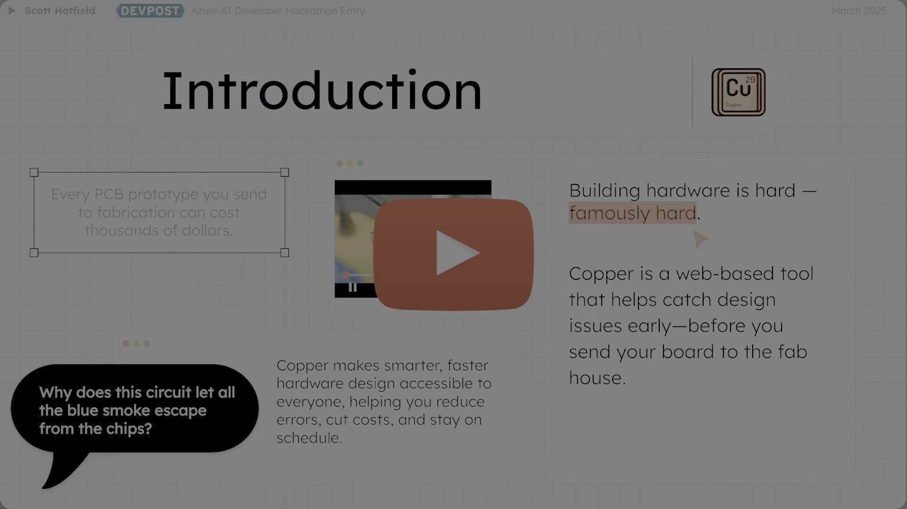
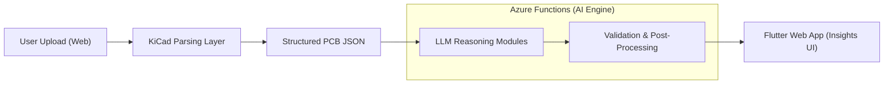

# Copper — Engineering Case Study  
### AI-Assisted PCB Diagnostics Platform

---

## 1. Overview

**Copper** is an end-to-end system designed to analyze printed circuit board (PCB) designs using structured reasoning workflows powered by large language models (LLMs). The platform ingests KiCad PCB layout files, converts them into a machine-interpretable structure, evaluates them using domain-specific heuristics and LLM-based reasoning, and delivers actionable design feedback through an interactive web UI.

Copper was developed as a fully autonomous system, encompassing:

- Cloud compute and serverless orchestration  
- Data transformation and modeling  
- AI-assisted analysis  
- Web application architecture  
- Parsing and domain-specific logic  

Copper earned **Winner — Microsoft Azure AI Developer Hackathon (2025)** for its innovative use of AI in technical engineering workflows.

---

## 2. Problem Space & Core Responsibilities

PCB design review is traditionally:

- Time-consuming  
- Error-prone  
- Dependent on deep domain expertise  
- Difficult to automate due to unstructured design data  

Copper addresses a central question:

> **How can unstructured PCB layout data be transformed into reliable engineering insights using AI?**

Engineering responsibilities included:

- Understanding PCB design constraints and structures  
- Designing a scalable, modular system for parsing and analysis  
- Creating predictable LLM-based reasoning workflows  
- Building an integrated web interface and supporting cloud services  
- Ensuring deterministic processing from ingestion through analysis

---

## 3. Architecture Summary

Copper’s architecture is composed of four major subsystems:

### A. Ingestion & Parsing Layer (KiCad Parser)

- Converts KiCad `.kicad_pcb` S-expressions into structured JSON  
- Normalizes geometric and electrical constructs  
- Establishes a deterministic schema for downstream AI processing

### B. Cloud Reasoning Engine (Azure Functions + Azure OpenAI)

- Stateless Azure Functions coordinate model execution, prompt templates, and validation  
- Enforces strict JSON schema outputs and predictable reasoning  
- Supports scalable, pay-per-execution compute

### C. Analysis Pipeline

Comprised of modular evaluators covering:

- Net integrity and connectivity  
- Component placement  
- Trace and clearance geometry  
- Cross-layer consistency  
- Manufacturability considerations  

The pipeline aggregates intermediate evaluations into final design insights.

### D. Web Application (Flutter Web)

- Displays structured analysis visually and interactively  
- Provides component-level feedback  
- Allows iterative uploads and updated analysis sessions  

---

## 4. High-Level System Diagram

---

## 5. Engineering Challenges & Solutions

### Challenge 1: Parsing Deeply Nested PCB S-Expressions  
KiCad files are irregular and difficult to tokenize reliably.

**Solution:**  
- Built a streaming parser with defensive grammar handling  
- Normalized geometric primitives and coordinate systems  
- Added pre-validation to ensure predictable downstream behavior  

---

### Challenge 2: Achieving Predictable AI Output  
LLMs are generative and non-deterministic by default.

**Solution:**  
- Designed structured prompt templates  
- Enforced JSON schemas and ordering constraints  
- Introduced retry and correction logic  
- Ensured all AI outputs were machine-validated  

---

### Challenge 3: Architecting for Rapid Iteration and Low Overhead  
Hackathon constraints required minimal infrastructure complexity.

**Solution:**  
- Used stateless Azure Functions for fast deployment and isolation  
- Enabled horizontal scalability with no persistent compute  
- Implemented modular services to simplify iteration  

---

### Challenge 4: Presenting Engineering Insights Clearly  
Raw LLM output or rule-based data is not inherently user-friendly.

**Solution:**  
- Created a tiered insight model (summary → categories → component details)  
- Built interactive UI elements for exploring PCB design findings  
- Focused on clear, contextual explanations for each detected issue  

---

## 6. Key Tradeoff Decisions

- **JSON over custom schemas:** Simpler debugging and better AI interoperability  
- **Separated parsing and reasoning:** Ensures deterministic preprocessing  
- **Serverless over containerized services:** Faster iteration and lower operational overhead  
- **Flutter Web for the UI:** Accelerated development and reuse of existing tooling  

---

## 7. Outcomes

- **Winner — Microsoft Azure AI Developer Hackathon (2025)**  
- Demonstrated feasibility of AI-assisted electronic design review  
- Produced a reusable foundation for future rule engines and analysis pipelines  
- Enabled clear, interpretable engineering feedback from complex PCB data  

---

## 8. Project Links

🔗 GitHub Repository: https://github.com/Toglefritz/Copper  
🔗 Azure AI Developer Hackathon Listing: https://devpost.com/software/copper-fwanji
