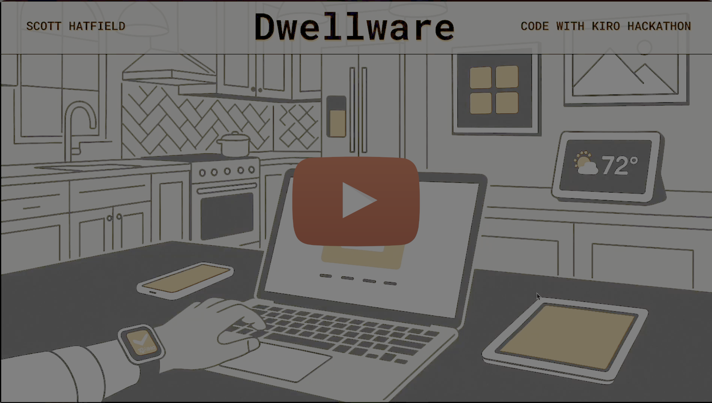
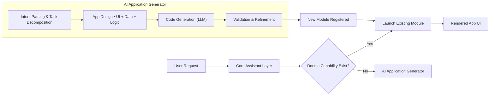

# Dwellware — Engineering Case Study  
### On‑Demand, AI‑Generated Applications for Intelligent Home Displays

---

## 1. Overview

**Dwellware** is an experimental home‑assistant platform built for the **Kiro AI Developer Hackathon (Amazon)**. The core idea explores a future in which advanced AI systems allow software to be **generated on demand**, creating bespoke applications that adapt to the needs of each individual user.

Modeled after devices such as Google Home Hub or Amazon Echo Show, Dwellware provides a persistent, screen‑based smart‑home interface. But unlike traditional systems—whose capabilities are limited to pre‑installed features—Dwellware dynamically builds **new applications in real time** when a user issues a request the system cannot yet fulfill.

The result is a home assistant capable of extending itself continuously, evolving into a personalized computing environment.

---

## 2. Problem Space & Motivation

Traditional home assistants suffer from several limitations:

- They are **static**. Their capabilities only expand when manually updated by developers.
- They cannot adapt to **unique, individualized workflows**.
- They require **significant engineering effort** for each new feature.
- They treat apps as **fixed, discrete artifacts**, not something generated in response to user needs.

Dwellware challenges this model by asking:

> **What if smart‑home devices could build new applications automatically, on demand, in response to natural‑language requests?**

This concept is enabled by:

- Agent-driven LLM workflows  
- Kiro’s AI‑assisted development environment  
- Dynamic code generation  
- Serverless execution and modular UI rendering  

---

## 3. High-Level Architecture

Dwellware’s system architecture is composed of three major components:

### A. Core Assistant Layer
The persistent UI and interaction engine responsible for:

- Displaying the main home‑assistant interface  
- Managing voice and text input  
- Handling navigation and multi‑app workflows  
- Tracking user context and preferences  

This layer provides the stable “shell” within which generated apps run.

---

### B. Application Generator (AI Pipeline)

When the user requests a capability not yet implemented, Dwellware:

1. **Decomposes the request** using LLM reasoning  
2. **Designs an application plan** (UI, data, logic, flows)  
3. **Generates source code** for the new module  
4. **Validates and refines** the generated output  
5. **Integrates** the new capability into the Dwellware environment

This creates a **loop of continuous system evolution**.

---

### C. Runtime & Module System

Generated applications are executed in a sandboxed environment:

- Component-based UI templates  
- Prefab interaction widgets  
- Declarative logic blocks  
- Safe execution sandbox  
- Dynamic registration into the main assistant  

This enables newly generated apps to behave like native features.

---

## 4. High-Level System Diagram (Mermaid)

---

## 5. Engineering Challenges & Solutions

### Challenge 1: Defining a Flexible, AI‑Friendly App Model  
Generated applications needed to be expressive enough to be useful, yet constrained enough for reliable code generation.

**Solution:**  
- Designed a modular UI system based on reusable components  
- Introduced declarative patterns for logic and event handling  
- Provided structured templates that guide LLM output into predictable shapes  

---

### Challenge 2: Ensuring Generated Code Is Safe & Executable  
LLM‑generated code can be incorrect, incomplete, or unsafe.

**Solution:**  
- Added refinement loops to validate syntax and correctness  
- Implemented sandboxed execution to isolate generated logic  
- Introduced structured prompts and schemas to reduce variability  

---

### Challenge 3: Integrating Newly Generated Modules Seamlessly  
Apps generated on-the-fly needed to behave like first‑class citizens within the main assistant.

**Solution:**  
- Created a runtime registry of modules with metadata  
- Provided automatic UI routing and navigation hooks  
- Enabled dynamic mounting/unmounting of app components  

---

### Challenge 4: Maintaining Interaction Context  
Users expect continuity—generated apps must respond to prior context.

**Solution:**  
- Implemented shared state storage for preferences and session data  
- Introduced context‑aware prompts for better AI interpretation  

---

## 6. Key Tradeoff Decisions

- Chose **sandboxed execution** over direct integration for safety.  
- Used **component templates** to reduce prompt complexity for the LLM.  
- Accepted limited UI complexity to ensure reliability of generated modules.  
- Prioritized **developer tooling speed** (aligned with the hackathon constraints).  

---

## 7. Outcomes

- Demonstrated a viable workflow for **on‑demand AI‑generated applications**.  
- Showed how home‑assistant platforms can become dynamically extensible.  
- Delivered an innovative entry for the **Kiro AI Developer Hackathon**.  
- Created a foundation for future agentic home‑assistant systems.

---

## 8. Project Links

🔗 GitHub Repository: https://github.com/Toglefritz/Dwellware
