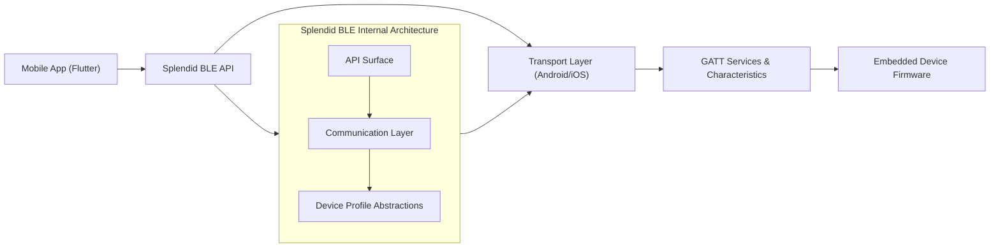

# Splendid BLE — Engineering Case Study  
### A Robust, Extensible, Multi‑Platform Bluetooth Low Energy Communication Layer

---

## 1. Overview

**Splendid BLE** is a multi‑platform Bluetooth Low Energy (BLE) communication library designed to provide a stable, extensible, and predictable foundation for mobile-to-device connectivity. Built to support production IoT applications, the library abstracts platform differences, manages BLE state transitions, and offers a structured API for discovering, connecting to, and exchanging data with embedded hardware.

The library has been used in both commercial and research environments, and was originally developed to power connected‑appliance integrations, real‑time sensor communication, and custom device protocol implementations.

---

## 2. Problem Space & Design Goals

BLE communication on mobile devices presents several engineering challenges:

- **Platform inconsistencies** between Android and iOS  
- **Unpredictable connection states**, timeouts, and peripheral lifecycle issues  
- **Differences in permissions, scanning behaviors, and background constraints**  
- **Unstructured data exchange**, requiring higher‑level protocol definition  
- **Need for reliability and observability** in real-time IoT systems  

Splendid BLE was designed to address these challenges with a focus on:

- **Predictability** — stable device discovery and connection flows  
- **Extensibility** — clean separation between transport logic and device‑specific protocols  
- **Clarity** — a structured API that exposes state transitions and error conditions  
- **Safety** — defensive handling of platform quirks and edge cases  
- **Developer experience** — coherent abstractions that simplify BLE workflows

---

## 3. Architecture Summary

Splendid BLE is organized into layered components that separate responsibilities clearly:

### A. Transport Layer  
Platform‑aware BLE primitives for:

- Scanning  
- Device metadata retrieval  
- Connection lifecycle management  
- Characteristic read/write  
- Notification streaming  

Each operation is normalized across Android and iOS to provide consistent behavior.

### B. Communication Layer (GATT Abstractions)

- Strongly typed UUID wrappers  
- Read/write helpers  
- Notification handlers  
- Error normalization  
- Characteristic caching strategies  

This layer reduces boilerplate and eliminates platform‑specific handling from application logic.

### C. Device Profile Layer

A framework for defining **device‑specific protocols**, including:

- Command/response serializations  
- Domain‑specific services and characteristic groupings  
- Message validation  
- Checksum or framing logic  
- State machine transitions  

This enables building full communication stacks on top of BLE without leaking low‑level details.

### D. State & Event Model

Splendid BLE uses a unified stream‑driven architecture to represent:

- Discovery events  
- Connection state  
- Service resolution  
- Characteristic changes  
- Errors and disconnects  

This allows the application to subscribe to BLE events in a predictable, reactive fashion.

---

## 4. High‑Level System Diagram

---

## 5. Engineering Challenges & Solutions

### Challenge 1: Platform Differences in BLE Behavior  
Android and iOS treat BLE scanning, connection retention, and notification delivery differently.

**Solution:**  
- Implemented normalization logic for scanning intervals, timeout behaviors, and connection retry strategies  
- Created an internal state machine to ensure predictable transitions regardless of platform  
- Added defensive code around permissions, adapter status, and OS‑level throttling  

---

### Challenge 2: Maintaining Stable Connections in Noisy RF Environments  
BLE peripherals may disconnect unexpectedly due to environmental factors.

**Solution:**  
- Automatic reconnection strategies  
- Detection of partial connections (e.g., missing services)  
- Graceful fallback and cleanup logic  
- Clear surfacing of connection reasons to the application layer  

---

### Challenge 3: Designing a Protocol‑Friendly API  
Applications often require custom device protocols on top of raw BLE characteristics.

**Solution:**  
- Created a domain‑specific protocol layer that supports message framing, serialization, validation, and command workflows  
- Enabled decoupling between hardware communication and domain logic  
- Added typed responses to reduce error surfaces  

---

### Challenge 4: Debugging and Observability  
BLE issues are notoriously difficult to diagnose.

**Solution:**  
- Added verbose logging modes  
- Provided structured error types  
- Included event‑stream tracing for connection, service resolution, and characteristic notifications  
- Ensured reproducible troubleshooting paths  

---

## 6. Key Tradeoff Decisions

- **Chose a reactive/event‑driven model** to simplify async workflows and reduce race conditions  
- **Abstracted platform‑specific APIs** to prevent application logic from depending on OS differences  
- **Avoided over‑automating** connection recovery to allow applications finer control when needed  
- **Chose a plugin architecture** that balances ease of use with extensibility for advanced BLE protocols  

---

## 7. Outcomes

- Enabled reliable communication for IoT and embedded devices in production apps  
- Reduced BLE complexity and boilerplate for application developers  
- Provided a stable foundation for building advanced device‑specific protocol stacks  
- Adopted by commercial and research teams for sensor communication and appliance connectivity  

---

## 9. Project Links

🔗 GitHub Repository: https://github.com/Toglefritz/flutter_splendid_ble  
🔗 Pub.dev Package: https://pub.dev/packages/flutter_splendid_ble
