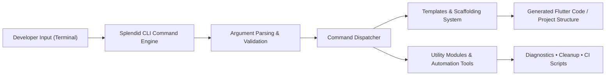

# Splendid CLI — Engineering Case Study  
### A Developer Tooling and Automation System for Scalable Flutter Applications

---

## 1. Overview

**Splendid CLI** is a command-line tool designed to streamline the creation, organization, and maintenance of large-scale Flutter applications. It automates repetitive tasks, enforces architectural conventions, and provides scaffolding utilities that help developers maintain consistency and quality across complex mobile codebases.

Originally built to support high-velocity mobile development on production apps, Splendid CLI introduces standardized workflows, modular code templates, and automation features that reduce cognitive load and improve long-term project maintainability.

---

## 2. Problem Space & Design Goals

Modern Flutter apps, especially those supporting enterprise features, multiple modules, or a long lifespan, face challenges such as:

- Maintaining **consistent architecture** across teams and components  
- Reducing **boilerplate** in feature creation  
- Automating **project setup** and common development flows  
- Preventing architectural drift over time  
- Improving developer onboarding speed  
- Enforcing internal conventions without manual oversight  

Splendid CLI was designed to solve these problems by focusing on:

- **Developer experience**  
- **Consistency and repeatability**  
- **Architectural clarity**  
- **Automation of repetitive tasks**  
- **Extensibility for future tooling**

---

## 3. Architecture Summary

Splendid CLI is composed of three major systems:

### A. Command Engine

A modular dispatcher that:

- Loads and runs user-invoked commands  
- Provides consistent terminal output formatting  
- Manages plugin initialization  
- Handles argument parsing and validation  

The engine provides a foundation for adding future automation tools without altering the CLI core.

---

### B. Template & Scaffolding System

A file-generation engine designed to:

- Produce boilerplate code for common Flutter patterns  
- Insert predefined architecture structures  
- Generate directories, classes, widgets, and feature modules  
- Enforce naming and layering conventions  
- Reduce setup time for new features or screens  

This system enables developers to build new features quickly while ensuring all code follows the same structural principles.

---

### C. Utility Modules & Automation

Additional commands provide:

- Project diagnostics  
- Automated cleanup or refactoring utilities  
- Auto-formatting tools

These utilities help ensure long-term maintainability and reduce manual work for engineering teams.

---

## 4. High-Level System Diagram (Mermaid)

---

## 5. Engineering Challenges & Solutions

### Challenge 1: Designing a Flexible Yet Predictable Command Architecture

Developers expect CLI tools to be both simple and extensible. Designing a system that allowed for growth without becoming brittle was a key challenge.

**Solution:**

- Built a modular command registry  
- Ensured each command operated independently of others  
- Introduced conventions for naming, output, and argument handling  
- Enabled the addition of new commands without modifying the core engine  

---

### Challenge 2: Ensuring Generated Code Remains Maintainable

Scaffolding tools risk producing low-quality or difficult-to-maintain code if not designed carefully.

**Solution:**

- Defined clear architectural templates  
- Ensured each generated module followed consistent naming and layout  
- Added placeholder comments for documentation and future developer guidance  
- Prioritized clarity and modularity in all templates  

---

### Challenge 3: Balancing Automation with Developer Control

Some tooling over-automates and restricts flexibility.

**Solution:**

- Allowed users to disable or override conventions  
- Ensured templates could be customized  
- Kept commands additive rather than prescriptive  
- Exposed underlying directory paths and settings for advanced users  

---

### Challenge 4: Creating a Smooth UX for Terminal-Based Tools

Developer adoption depends heavily on usability.

**Solution:**

- Implemented clean terminal formatting and colorized output  
- Provided descriptive error messages and success indicators  
- Added interactive prompts for certain workflows  
- Ensured commands fail safely with actionable errors  

---

## 6. Key Tradeoff Decisions

- **Chose a template-driven system** over dynamic code generation for clarity and maintainability  
- **Kept dependencies minimal** to ensure the CLI stays lightweight and fast  
- **Used structured argument parsing** to avoid ambiguity in command interpretation  
- **Designed commands to be stateless** for easier testing and reproducibility  

---

## 7. Outcomes

- Reduced onboarding time for new developers on modular Flutter codebases  
- Increased consistency across large projects through standardized scaffolding  
- Improved developer experience with clean commands and predictable automation  
- Enabled engineering teams to scale codebases more efficiently  

---

## 8. Project Links

🔗 GitHub Repository: https://github.com/Toglefritz/splendid_cli  
🔗 Pub.dev Package: https://pub.dev/packages/splendid_cli
